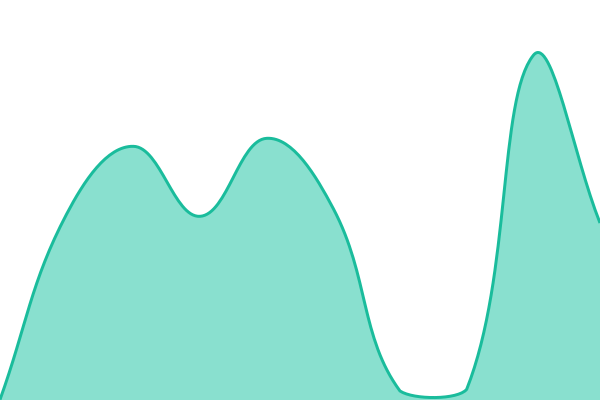

# [📈 Live Status](https://templain.github.io/mywatcher): <!--live status--> **🟩 All systems operational**

This repository contains the open-source uptime monitor and status page for [templain](https://templain.github.io/mywatcher), powered by [Upptime](https://github.com/upptime/upptime).

With [Upptime](https://upptime.js.org), you can get your own unlimited and free uptime monitor and status page, powered entirely by a GitHub repository. We use [Issues](https://github.com/templain/mywatcher/issues) as incident reports, [Actions](https://github.com/templain/mywatcher/actions) as uptime monitors, and [Pages](https://templain.github.io/mywatcher) for the status page.

<!--start: status pages-->
<!-- This summary is generated by Upptime (https://github.com/upptime/upptime) -->
<!-- Do not edit this manually, your changes will be overwritten -->
<!-- prettier-ignore -->
| URL | Status | History | Response Time | Uptime |
| --- | ------ | ------- | ------------- | ------ |
|  WEBAPI | 🟩 Up | [webapi.yml](https://github.com/templain/mywatcher/commits/HEAD/history/webapi.yml) | 

 468ms
     
 | 

<a href="https://templain.github.io/mywatcher/history/webapi">87.36%</a>
    

|  MYSITE | 🟩 Up | [mysite.yml](https://github.com/templain/mywatcher/commits/HEAD/history/mysite.yml) | 

 2799ms
     
 | 

<a href="https://templain.github.io/mywatcher/history/mysite">84.48%</a>
    

<!--end: status pages-->

[**Visit our status website →**](https://templain.github.io/mywatcher)

## 📄 License

- Powered by: [Upptime](https://github.com/upptime/upptime)
- Code: [MIT](./LICENSE) © [templain](https://templain.github.io/mywatcher)
- Data in the `./history` directory: [Open Database License](https://opendatacommons.org/licenses/odbl/1-0/)
